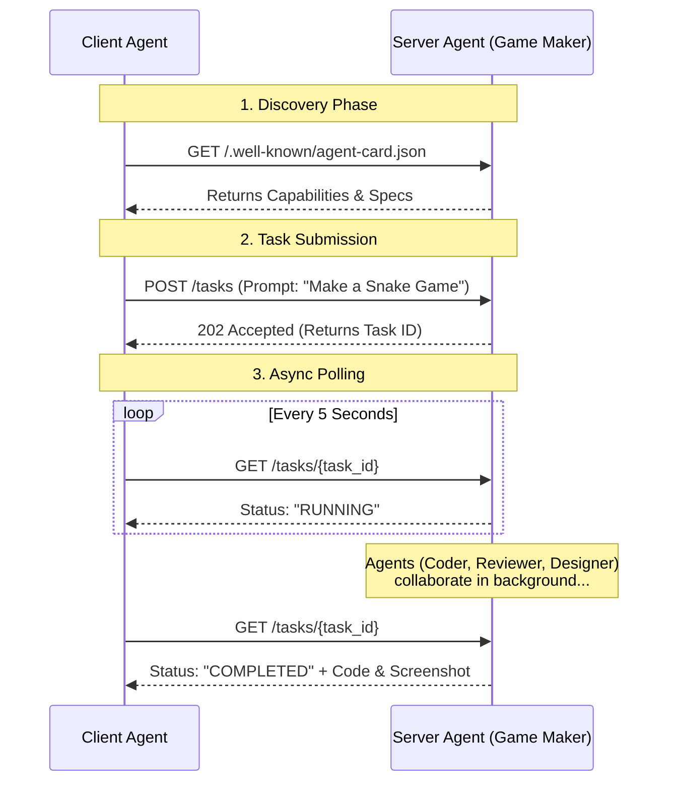

# Agent to Agent (A2A)

**Agent to Agent (A2A)** refers to direct communication and collaboration between two or more intelligent agents (AI software, robots, services) without direct human intervention. They exchange information, negotiate, and coordinate actions to achieve individual or collective goals.

In a traditional "Human-to-Agent" model, a human prompts an LLM and manually handles the output. A2A automates this chain, allowing agents to delegate sub-tasks to other specialized agents.

## Why A2A?

In complex tasks, such as planning an international trip involving multiple specialized agents (e.g., flight, hotel, currency conversion), A2A resolves the following issues that arise when integrating diverse agents without a standard protocol:

*   **Agent Exposure Inefficiency**: Without A2A, agents are often inefficiently wrapped as tools to be exposed to other agents (e.g., in a Multi-agent Control Platform). A2A allows agents to be exposed as they are, enabling direct negotiation and preserving their full capabilities.
*   **Custom Integrations**: It eliminates the need for custom, point-to-point solutions for every interaction, which currently creates significant engineering overhead.
*   **Slow Innovation**: By removing bespoke development requirements for new integrations, A2A helps accelerate innovation.
*   **Scalability and Maintenance**: It prevents systems from becoming difficult to scale and maintain as the number of agents and interactions increases.
*   **Interoperability**: The protocol overcomes limitations in interoperability, facilitating the organic formation of complex AI ecosystems.
*   **Security Gaps**: It addresses security issues that result from ad hoc communication by providing a framework for consistent security measures.

In short, A2A enables a more efficient, scalable, and secure environment for AI agents to interact and collaborate.

## Core architectural components

The A2A protocol defines standard RESTful interfaces for agents to discover and interact with each other.

### 1. A2A Client (Client Agent)
The client agent (`a2a_client.py`) is the initiator. It can be a user-facing application or another agent that needs to delegate a task.
*   **Role**: Discovers service -> Submits Task -> Polls for Result.
*   **Example**: A "Trip Planner Agent" (Client) asks a "Booking Agent" (Server) to reserve a flight.

### 2. A2A Server (Remote Agent)
The server agent (`a2a_server.py`) is the worker. It provides a standardized HTTP API to accept tasks.
*   **Role**: Publishes Agent Card -> Accepts Task -> Executes in Background -> Returns Result.
*   **Internals**: Behind the simple API, the server can run complex logic. For example, `game_maker_agent.py` runs a multi-agent team (Supervisor, Coder, Reviewer, Designer) to generate code, execute it, and visually inspect the results.

### 3. Agent Card
A JSON metadata file located at `/.well-known/agent-card.json`. It acts as a business card, allowing clients to understand what the agent does.
```json
{
    "name": "GameCodeGenerator",
    "version": "1.0",
    "description": "Agent specialized in writing Python game code (Tkinter).",
    "serviceEndpoint": "http://127.0.0.1:5000",
    "capabilities": ["python_coding", "tkinter_gui"],
    "supported_modalities": ["text"],
    "authRequired": false
}
```

### 4. Task
A unit of work submitted to the server.
*   **Submission**: Client sends a POST request to `/tasks` with `prompt` and `client_metadata`.
*   **Status**: Tasks have states (SUBMITTED, WORKING, COMPLETED, FAILED).
*   **Asynchronous**: The server returns a `task_id` immediately (HTTP 202 Accepted), and the client polls standard endpoints to check progress.

### 5. Message & Artifact
*   **Message**: The content exchanged (prompts, status updates).
*   **Artifacts**: Tangible outputs generated by the server. In our reference implementation, the artifact is the generated Python code (`generated_game_result.py`) and a screenshot of the game.

## Protocol Flow



## Reference Implementation

The provided code demonstrates a functional A2A system:

### Server Side (`a2a_server.py`)
This script acts as the A2A Node.
*   **Agent Card**: Served at `GET /.well-known/agent-card.json`.
*   **Task Store**: Uses an in-memory dictionary `TASKS = {}` to track job status.
*   **Background Processing**: Uses `threading` to run the heavy `process_task` function without blocking the API.

### Workflow Engine (`game_maker_agent.py`)
This represents the "Brain" of the server agent. It showcases how an A2A node can be more than just a simple LLM wrapper.
*   **Supervisor Node**: A meta-agent that coordinates other agents.
*   **Tools**: Can execute code (`execute_and_capture_screenshot`) and see visuals.
*   **Loop**: Coder writes code -> System runs it -> Designer + Reviewer critique it -> Supervisor decides next step.

### Client Side (`a2a_client.py`)
This script acts as the Consumer.
1.  **Discovery**: Fetches and prints the Agent Card.
2.  **Submit**: POSTs a request ("Write a simple snake game...").
3.  **Poll**: Loops checking `GET /tasks/<task_id>` until status is `COMPLETED`.
4.  **Consumes**: Saves the resulting code to a local file.
